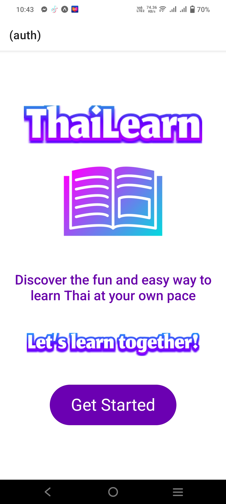
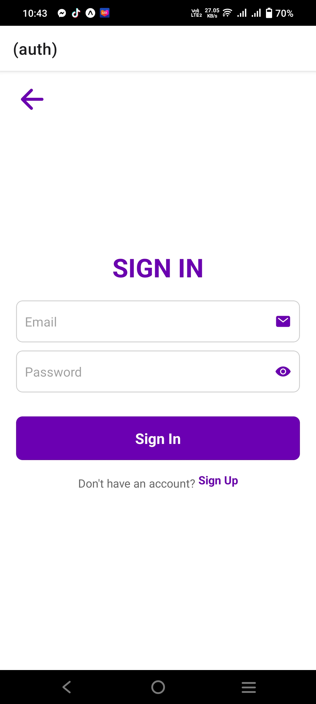
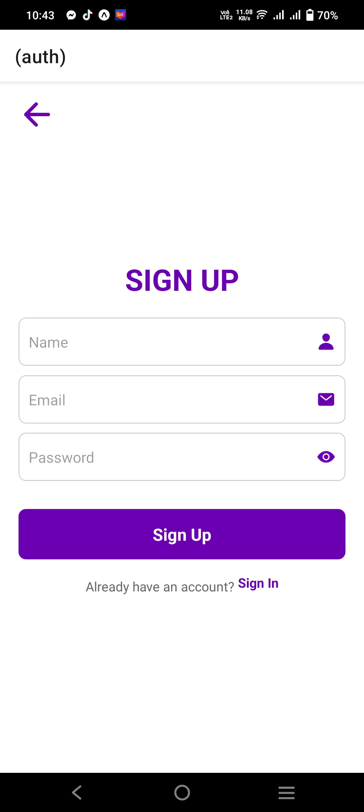
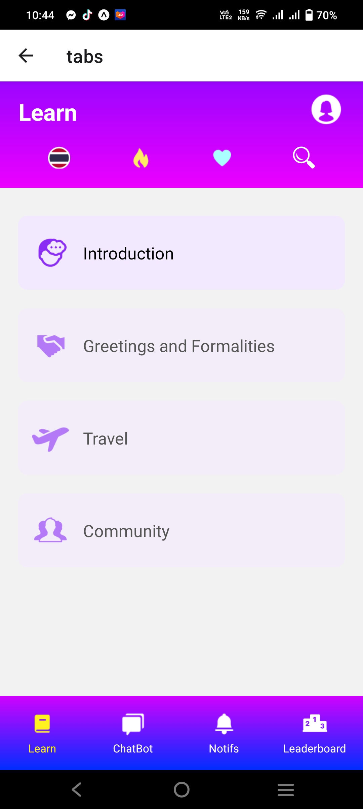
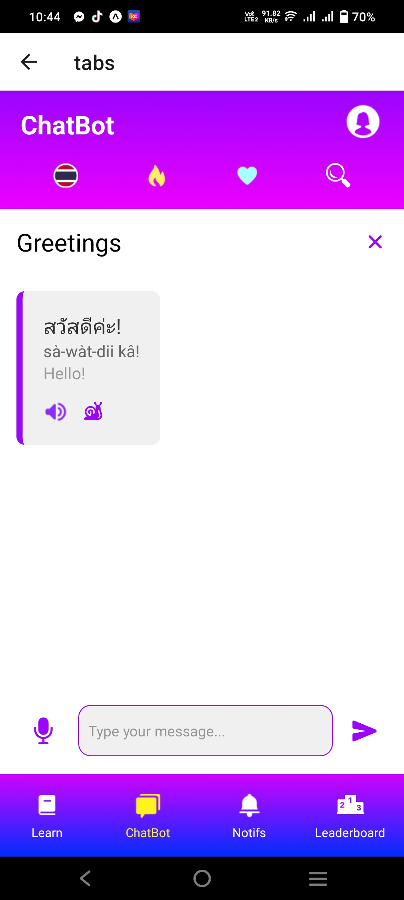
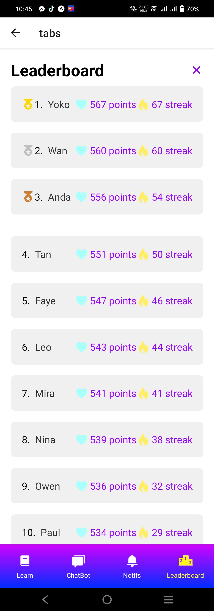

# ThaiLearn
Thai Language Learning App

# Features
* Quizzes and Challenges
* Interactivity
* Progress Tracker
* Profile Account

# Tech Stack
* React Native
* AppWrite
* HTML, CSS and JS

# Home Screen
  

# Sign In Screen
  

# Sign Up Screen
  

# Learn (Home Screen)
 

# ChatBot
 

# Leaderboard
 

# Profile Account
 
