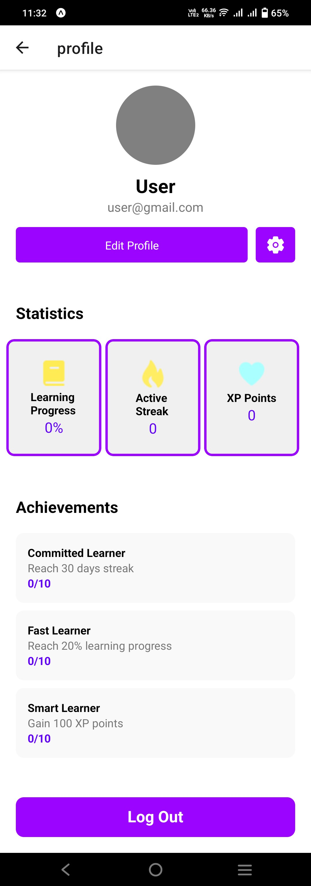

# ThaiLearn
Thai Language Learning App

# Features
* Quizzes and Challenges
* Interactivity
* Progress Tracker
* Profile Account

# Software Stack
* React Native
* HTML, CSS and JS

# Home Screen
  

# Sign In Screen
  

# Sign Up Screen
  

# Tab Screens
 
 
 
 
